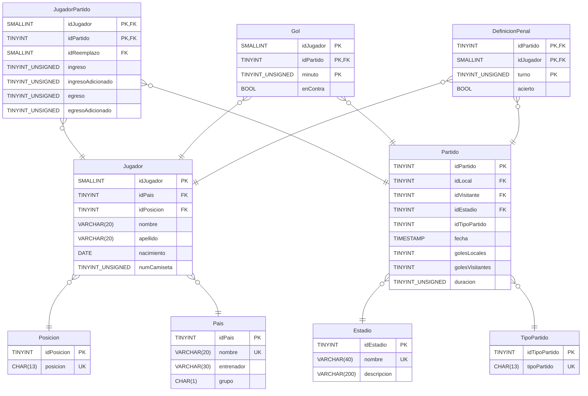

<h1 align="center"> E.T. Nº12 D.E. 1º "Libertador Gral. José de San Martín" </h1>
<p align="center">
  
</p>

## Computación : 2025

**Nombre TP**: EduBank

**Apellido y Nombre Alumno**: Miguel Verdugues, Josu Duran,

**Curso**: 6 ° 7

# EduBank
Este proyecto es un Sistema Bancario Backend desarrollado con Node.js y Express que proporciona una API RESTful completa para gestionar operaciones bancarias. El sistema incluye módulos para:

- Gestión de Usuarios (clientes, empleados, gerentes)
- Sucursales Bancarias
- Tipos de Cuentas (Caja de Ahorro, Cuenta Corriente, etc.)
- Cuentas Bancarias con CBU único
- Transacciones (transferencias, depósitos, retiros)
- Tarjetas (débito y crédito)
- Préstamos
- Auditoría de operaciones
- Notificaciones a usuarios



## Comenzando 🚀

Clonar el repositorio github, desde Github Desktop o ejecutar en la terminal o CMD:

```
https://github.com/JosuGuzman/EduBank
```

## Pre-requisitos 📋
